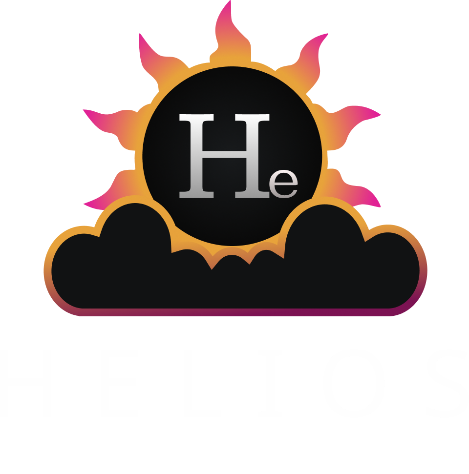

  

   

___

  

# Helios Gateway

Cloud-native GraphQL federation gateway built on top of Apollo Federation Gateway.

Helios Gateway provides dynamic service discovery, Firebase authentication, RBAC, and an admin console for managing distributed GraphQL services across cloud and local environments.

## Features

- Apollo Federation Gateway–based runtime
- Dynamic service discovery
  - Google Cloud Run
  - Docker
  - Static YAML configuration
- Firebase Authentication integration
- Role-based access control (RBAC)
- Admin console
- Cloud-native and Docker-friendly
- Designed for self-hosted federated GraphQL platforms

## Licensing

Helios Gateway depends on `@apollo/gateway`, which is licensed under Elastic License 2.0 (ELv2).

This project itself is independently licensed under Apache License 2.0 and is not affiliated with or endorsed by Apollo GraphQL.

Users of this project are responsible for complying with the licenses of all included dependencies.
