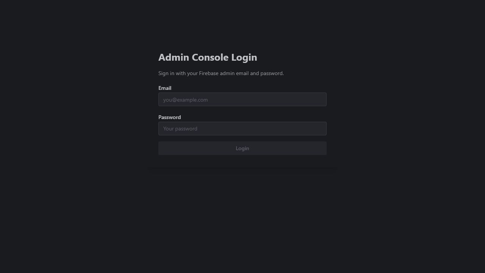
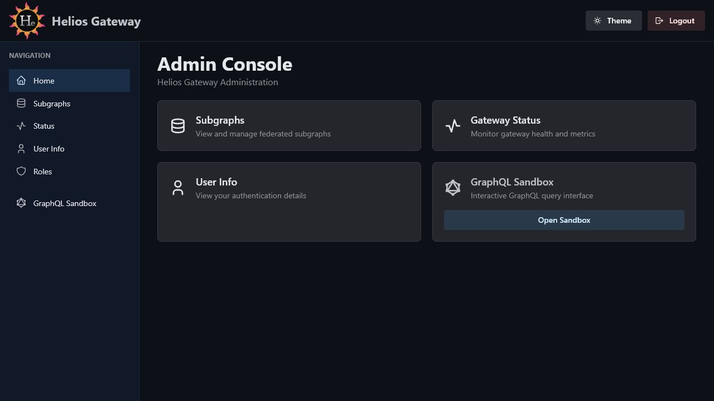

# Admin Console

The Admin Console is the browser UI for operating Helios Gateway. It is served
by the gateway at:

```text
http://localhost:4000/admin/console/
```

The console requires Firebase authentication. After login, the layout provides
persistent navigation for gateway operations, user information, role assignment,
and GraphQL Sandbox access.

## Navigation

The authenticated console shell includes:

- Header with logo, graph scope when configured, theme toggle, and logout button.
- Sidebar links for Home, Subgraphs, Status, User Info, Roles, and GraphQL Sandbox.
- Main content area for the selected page.

## Login

Route: `/admin/console/login`

The login page signs an operator into the Admin Console with Firebase
Authentication. Once the user is authenticated, the gateway can verify the
session and allow access to the protected console views.



## Home

Route: `/admin/console/`

The home page is the console dashboard. It gives operators a quick starting
point for common tasks such as inspecting subgraphs, checking gateway status,
reviewing user information, managing roles, and opening GraphQL Sandbox.



## Subgraphs

Route: `/admin/console/subgraphs`

The subgraphs page lists discovered services from the active discovery provider.
Operators can inspect service names, URLs, labels, graph scope, and health
state, which makes it the main page for confirming that federation discovery is
working as expected.


## Gateway Status

Route: `/admin/console/status`

The status page shows the runtime state of the gateway, including uptime,
discovery mode, configured graph scope, and the number of services currently
known to the gateway.


## User Information

Route: `/admin/console/user`

The user information page shows the current Firebase user identity and token
details. It helps operators verify which UID, email, roles, and claims are being
used for admin-console authorization.


## Role Management

Route: `/admin/console/roles`

The role management page assigns Firebase custom-claim roles by email or UID.
Use it to grant or update admin and application roles that the gateway can later
read from verified Firebase tokens.


## GraphQL Sandbox Health Check

Route: Sidebar action

Before opening GraphQL Sandbox, the console can check discovered subgraphs and
surface any failing services. This helps operators avoid opening a graph session
against a partially unavailable federation.


When the health check completes, the modal summarizes the state of the discovered
subgraphs and lets the operator continue to Sandbox when the environment is
ready.


