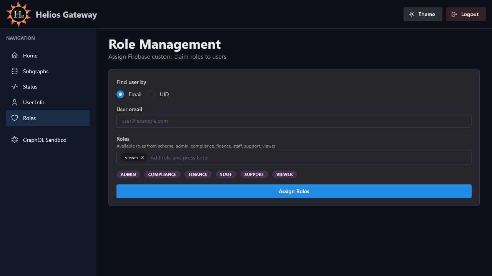

# Admin Console Role Management

The Role Management page assigns Firebase custom-claim roles to users.



## Route

```text
/admin/console/roles
```

## Purpose

Use this page when an administrator needs to grant or update application roles for another Firebase user.

## Controls

| Control | Description |
| --- | --- |
| `Find user by` | Choose whether to identify the target user by email or UID. |
| `User email` / `User UID` | Identifier for the user receiving roles. |
| `Roles` | Tag input for one or more roles. |
| `Assign Roles` | Submits the role assignment to the admin API. |

## Available Roles

The page loads roles discovered from the current schema and shows them as hints for the tag input. You can still type role values manually.

## Result States

- Success shows a `Roles updated` alert with UID, email, and assigned roles.
- Errors show an `Error` alert with the admin API response.
- Some successful responses may include an `Important` note, for example when the affected user must refresh their token.
