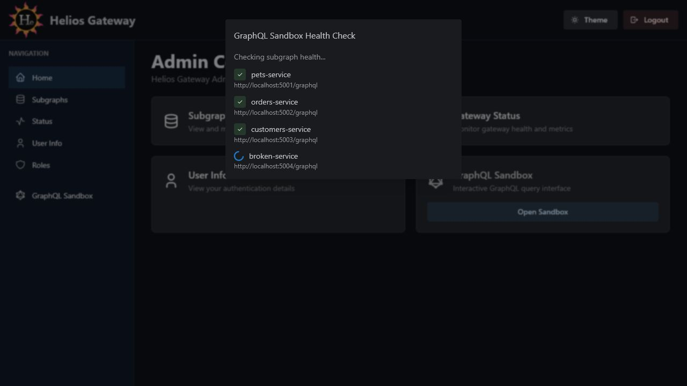
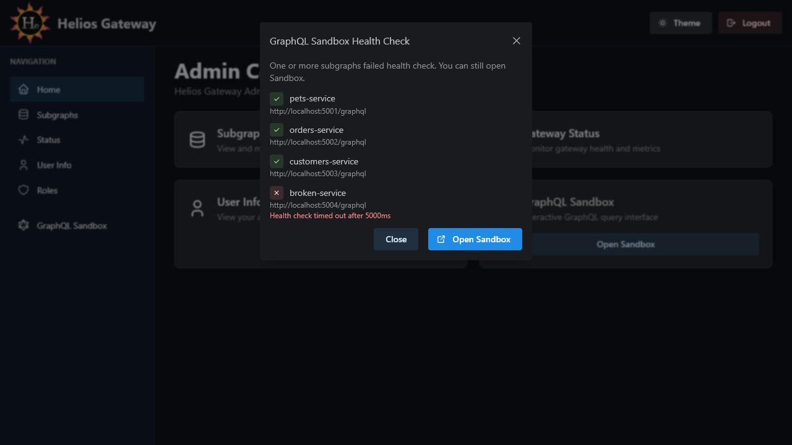

# Admin Console GraphQL Sandbox

The GraphQL Sandbox action opens an authenticated GraphQL query interface after preparing a gateway session.

## Route

GraphQL Sandbox is a sidebar action rather than a standalone React route.

## Purpose

Use this action to open Apollo Sandbox with the current admin identity. Before opening Sandbox, the console can check discovered subgraph health so operators understand whether the composed graph is likely to respond cleanly.

## Health Check Modal

The modal lists each discovered subgraph and its GraphQL URL. It then reports whether all subgraphs responded successfully.

Possible summaries include:

- `Checking subgraph health...`
- `All discovered subgraphs responded successfully. You can open Sandbox.`
- `One or more subgraphs failed health check. You can still open Sandbox.`
- `No discovered subgraphs. You can open Sandbox.`

## Actions

- `Close`: dismisses the modal.
- `Open Sandbox`: creates an authenticated session and opens `/graphql` with a CSRF token.

## Failure Notes

If a subgraph is unavailable or slow, the modal shows the failed service and error message. Operators can still open Sandbox, but queries that require failed subgraphs may return errors.
