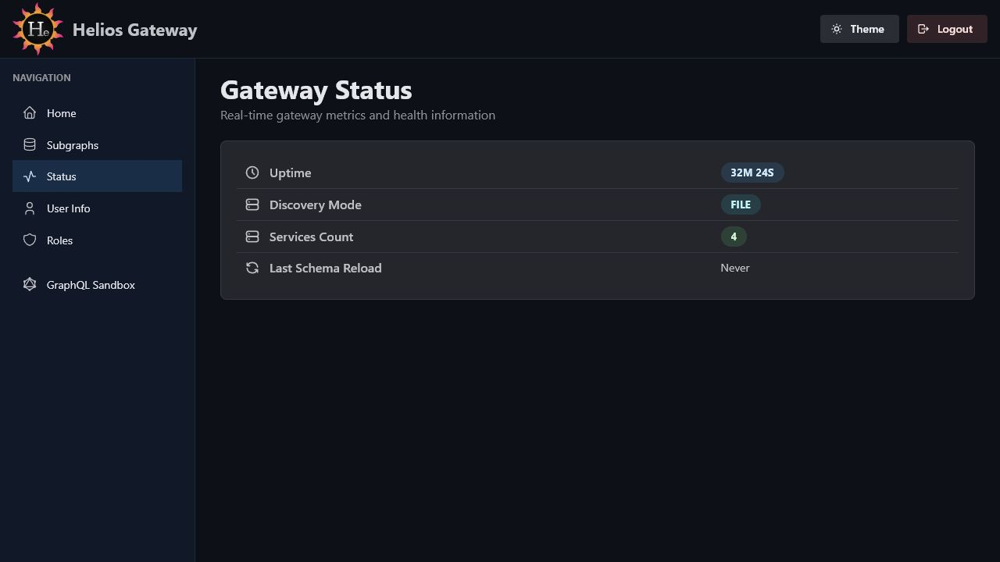

# Admin Console Gateway Status

The Gateway Status page shows runtime information for the current gateway process.



## Route

```text
/admin/console/status
```

## Purpose

Use this page to verify that the gateway is running, which discovery mode is active, and how many services are currently known.

## Metrics

| Metric | Description |
| --- | --- |
| `Uptime` | Time since the gateway process started. |
| `Discovery Mode` | Active discovery provider: Cloud Run, Docker, or file. |
| `Services Count` | Number of discovered subgraph services. |

## Refresh Behavior

The page refreshes status data every 10 seconds while it is open.

## Hidden Row

The code keeps a `Last Schema Reload` row behind a local feature flag. It is currently hidden from the UI.
