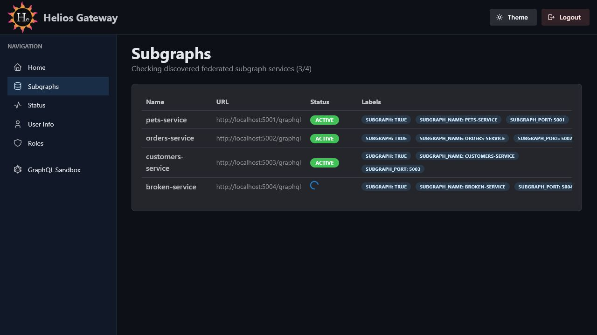

# Admin Console Subgraphs

The Subgraphs page shows the federated services discovered by Helios Gateway.



## Route

```text
/admin/console/subgraphs
```

## Purpose

Use this page to confirm which subgraph services are currently visible to the gateway and whether each service responds to health checks.

## Data Shown

| Column | Description |
| --- | --- |
| `Name` | Subgraph name discovered from Cloud Run, Docker, or file discovery. |
| `URL` | GraphQL endpoint used by the gateway for that subgraph. |
| `Status` | Health-check state: loading, active, or failed. |
| `Labels` | Discovery labels associated with the service, such as graph scope labels. |

## Loading and Empty States

- While the initial list loads, the page shows `Loading subgraphs...`.
- While health checks stream in, the subtitle shows progress like `Checking discovered federated subgraph services (2/4)`.
- If no services are discovered, the page shows a `No Subgraphs` alert.
