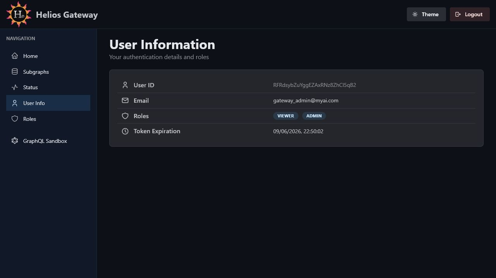

# Admin Console User Information

The User Information page shows details for the authenticated Firebase user.



## Route

```text
/admin/console/user
```

## Purpose

Use this page to verify the current identity and role claims used by the admin API.

## Data Shown

| Field | Description |
| --- | --- |
| `User ID` | Firebase UID for the signed-in user. |
| `Email` | Firebase email address when available. |
| `Roles` | Role claims attached to the current user. |
| `Token Expiration` | Expiration timestamp for the current auth token. |

## Access Notes

The page calls the admin API with the current bearer token. If the token is missing, expired, or rejected, the page shows an error alert.
