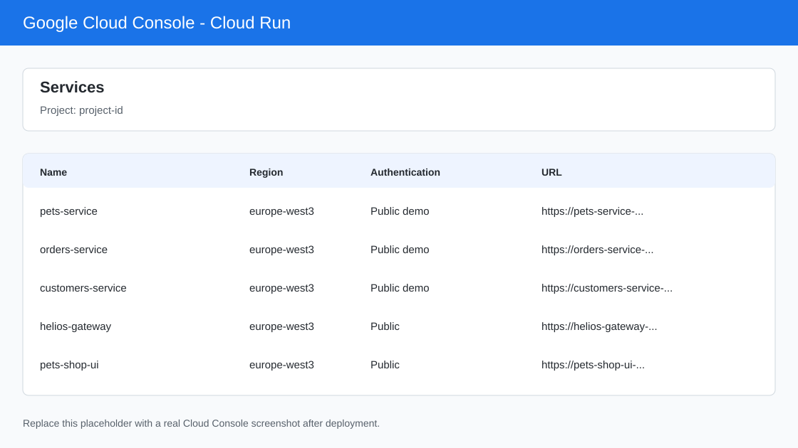
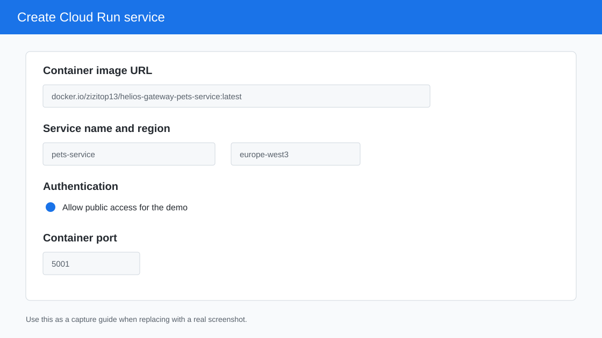
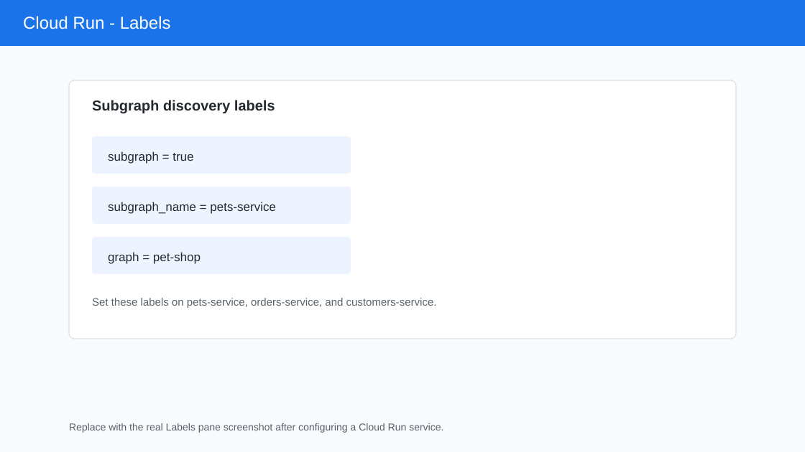
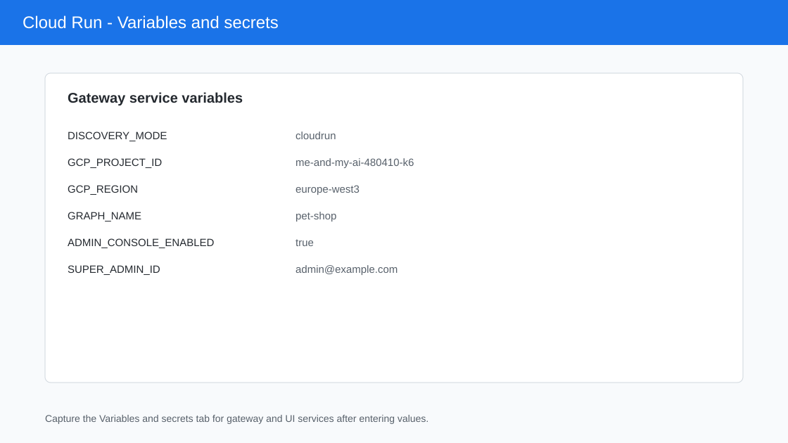

# Google Cloud Run Demo

This article walks through a manual Google Cloud Run installation for Helios
Gateway and the pet-shop demo. It deploys:

- `pets-service`
- `orders-service`
- `customers-service`
- `helios-gateway`
- `pets-shop-ui`

Project used in examples:

[project-id Cloud Run services](https://console.cloud.google.com/run/services?project=project-id)

Primary references:

- [Deploying container images to Cloud Run](https://docs.cloud.google.com/run/docs/deploying)
- [Allowing public access to Cloud Run](https://docs.cloud.google.com/run/docs/authenticating/public)
- [Configure environment variables for Cloud Run services](https://docs.cloud.google.com/run/docs/configuring/services/environment-variables)
- [Add Firebase to your JavaScript project](https://firebase.google.com/docs/web/setup)
- [GitHub Actions reusable workflows](https://docs.github.com/en/actions/how-tos/reuse-automations/reuse-workflows)

The screenshots below are capture guides. Replace them with real screenshots
from the project after the services are deployed.



## Prerequisites

1. Docker images are published by the repository workflows.
2. The Google Cloud project has Cloud Run enabled.
3. The same Google Cloud project is added to Firebase.
4. Firebase Authentication has Email/Password sign-in enabled.
5. A Firebase Web App exists for the Admin Console and test UI.
6. Your Google account can create Cloud Run services and update IAM/security
   settings in the project.

## Images

The demo-services workflow publishes the subgraph and UI images to Docker Hub
and GHCR.

| Service | Docker Hub image |
| --- | --- |
| `helios-gateway` | `docker.io/zizitop13/helios-gateway:latest` |
| `pets-service` | `docker.io/zizitop13/helios-gateway-pets-service:latest` |
| `orders-service` | `docker.io/zizitop13/helios-gateway-orders-service:latest` |
| `customers-service` | `docker.io/zizitop13/helios-gateway-customers-service:latest` |
| `pets-shop-ui` | `docker.io/zizitop13/helios-gateway-pets-shop-ui:latest` |

The UI image is runtime-configurable. Set the `VITE_*` variables on the Cloud
Run service instead of rebuilding the image for each project.

## Automated GitHub Actions Install

The repository also provides a reusable workflow for installing the gateway in
a target Google Cloud project. It deploys only `helios-gateway`; the gateway
then discovers any labeled Cloud Run subgraphs in the configured project and
region.

Create a service account JSON key in the target project and save it as a GitHub
secret named `GCP_SA_KEY` in the caller repository. For the default installer
settings, that service account needs enough permission to:

- enable required project APIs
- create and deploy the gateway Cloud Run service
- create or use the gateway runtime service account
- grant the runtime service account Cloud Run discovery and Firebase Auth roles

A practical demo role set is:

| Purpose | Role |
| --- | --- |
| Enable APIs | `roles/serviceusage.serviceUsageAdmin` |
| Deploy services | `roles/run.admin` |
| Create runtime service account | `roles/iam.serviceAccountAdmin` |
| Attach runtime service account to Cloud Run | `roles/iam.serviceAccountUser` |
| Grant runtime IAM roles | `roles/resourcemanager.projectIamAdmin` |

The runtime service account receives `roles/run.viewer` so the gateway can
discover labeled Cloud Run subgraphs, and `roles/firebaseauth.admin` so the
Admin Console can manage Firebase Authentication users and custom claims.

Add this workflow to the repository that should install Helios:

```yaml
name: Install Helios Gateway

on:
  workflow_dispatch:

jobs:
  install:
    uses: zizitop13/helios-gateway/.github/workflows/install-helios-cloudrun.yml@main
    with:
      project_id: project-id
      region: europe-west3
      graph_name: pet-shop
      super_admin_id: admin@example.com
      firebase_api_key: ${{ vars.FIREBASE_API_KEY }}
      firebase_auth_domain: ${{ vars.FIREBASE_AUTH_DOMAIN }}
      firebase_storage_bucket: ${{ vars.FIREBASE_STORAGE_BUCKET }}
      firebase_messaging_sender_id: ${{ vars.FIREBASE_MESSAGING_SENDER_ID }}
      firebase_app_id: ${{ vars.FIREBASE_APP_ID }}
      firebase_measurement_id: ${{ vars.FIREBASE_MEASUREMENT_ID }}
    secrets:
      GCP_SA_KEY: ${{ secrets.GCP_SA_KEY }}
```

For repeatable demos, pin the workflow reference to a release tag instead of
`main`.

After the workflow finishes, open the job summary. It prints:

- gateway URL
- Admin Console URL
- GraphQL URL
- Firebase authorized domains to add
- the labels Cloud Run subgraphs must have for gateway discovery

The default gateway image is `docker.io/zizitop13/helios-gateway:latest`.
Override `gateway_image` or `gateway_service_name` when installing a custom
build.

If downstream subgraphs require Cloud Run IAM authentication, enable identity
token calls from the gateway:

```yaml
with:
  enable_cloud_run_iam_auth: true
```

If your project has already been prepared by an administrator, you can lower
the installer permissions:

```yaml
with:
  enable_required_apis: false
  create_runtime_service_account: false
  runtime_service_account: helios-gateway-runtime@PROJECT_ID.iam.gserviceaccount.com
```

In that mode, create the runtime service account and IAM bindings before the
workflow runs.

## Firebase Setup

Open [Firebase Console](https://console.firebase.google.com/) and select the
same project used by Cloud Run.

1. Add Firebase to the existing Google Cloud project if it is not already
   attached.
2. In Authentication, enable Email/Password sign-in.
3. Create a Web App and copy its Firebase config values.
4. In Authentication settings, add the Cloud Run domains for `helios-gateway`
   and `pets-shop-ui` as authorized domains after both services have URLs.
5. Create an initial user, for example `admin@example.com`.

The gateway uses `SUPER_ADMIN_ID=admin@example.com` for the first admin login.
After signing in to the Admin Console, use the Roles page to assign custom-claim
roles to demo users.

Useful demo users:

| Email | Suggested roles |
| --- | --- |
| `admin@example.com` | `admin`, `finance`, `staff`, `support`, `viewer` |
| `viewer@example.com` | `viewer` |
| `staff@example.com` | `staff`, `viewer` |
| `support@example.com` | `support`, `viewer` |

## Deploy Subgraphs

In the Cloud Console, open Cloud Run and click **Create service**.



Deploy the three subgraphs first. Use one region for all services. The examples
below use `europe-west3`.

| Service | Image | Container port | Labels |
| --- | --- | --- | --- |
| `pets-service` | `docker.io/zizitop13/helios-gateway-pets-service:latest` | `5001` | `subgraph=true`, `subgraph_name=pets-service`, `graph=pet-shop` |
| `orders-service` | `docker.io/zizitop13/helios-gateway-orders-service:latest` | `5002` | `subgraph=true`, `subgraph_name=orders-service`, `graph=pet-shop` |
| `customers-service` | `docker.io/zizitop13/helios-gateway-customers-service:latest` | `5003` | `subgraph=true`, `subgraph_name=customers-service`, `graph=pet-shop` |

For each service:

1. Set **Container image URL**.
2. Set **Service name**.
3. Set **Region** to the shared region.
4. In **Authentication**, choose **Allow public access** for the demo.
5. In **Container(s), volumes, networking, security**, set the container port.
6. In **Labels**, add the subgraph discovery labels.
7. Click **Create**.



Do not add `PORT` as an environment variable. Cloud Run injects it from the
configured container port.

Public subgraphs keep the manual demo simple. For a private production setup,
enable `ENABLE_CLOUD_RUN_IAM_AUTH=true` on the gateway and grant its service
account permission to invoke the subgraph services.

## Deploy Gateway

Create a fourth Cloud Run service.

| Setting | Value |
| --- | --- |
| Service name | `helios-gateway` |
| Image | `docker.io/zizitop13/helios-gateway:latest` |
| Region | Same as subgraphs, for example `europe-west3` |
| Container port | `4000` |
| Authentication | Allow public access |

Add these environment variables:

| Variable | Value |
| --- | --- |
| `DISCOVERY_MODE` | `cloudrun` |
| `GCP_PROJECT_ID` | `project-id` |
| `GCP_REGION` | `europe-west3` |
| `FIREBASE_PROJECT_ID` | `project-id` |
| `GRAPH_NAME` | `pet-shop` |
| `GRAPH_LABEL_KEY` | `graph` |
| `SUPER_ADMIN_ID` | `admin@example.com` |
| `ADMIN_CONSOLE_ENABLED` | `true` |
| `ADMIN_CONSOLE_FIREBASE_API_KEY` | Firebase web config `apiKey` |
| `ADMIN_CONSOLE_FIREBASE_AUTH_DOMAIN` | Firebase web config `authDomain` |
| `ADMIN_CONSOLE_FIREBASE_PROJECT_ID` | Firebase web config `projectId` |
| `ADMIN_CONSOLE_FIREBASE_STORAGE_BUCKET` | Firebase web config `storageBucket` |
| `ADMIN_CONSOLE_FIREBASE_MESSAGING_SENDER_ID` | Firebase web config `messagingSenderId` |
| `ADMIN_CONSOLE_FIREBASE_APP_ID` | Firebase web config `appId` |
| `ADMIN_CONSOLE_FIREBASE_MEASUREMENT_ID` | Firebase web config `measurementId`, optional |
| `ENABLE_APOLLO_SANDBOX` | `true` |
| `ENABLE_SCHEMA_REFRESH` | `true` |
| `SCHEMA_REFRESH_INTERVAL_SECONDS` | `30` |
| `ENABLE_CLOUD_RUN_IAM_AUTH` | `true` only when subgraphs require Cloud Run IAM authentication |



After the service is ready, open:

```text
https://<helios-gateway-url>/health
https://<helios-gateway-url>/admin/console/
https://<helios-gateway-url>/graphql
```

Expected `/health` response:

```json
{
  "status": "ok"
}
```

## Deploy Pets Shop UI

Create the UI service after the gateway URL is known.

| Setting | Value |
| --- | --- |
| Service name | `pets-shop-ui` |
| Image | `docker.io/zizitop13/helios-gateway-pets-shop-ui:latest` |
| Region | Same as gateway |
| Container port | `8080` |
| Authentication | Allow public access |

Add these environment variables:

| Variable | Value |
| --- | --- |
| `VITE_GATEWAY_URL` | `https://<helios-gateway-url>` |
| `VITE_FIREBASE_API_KEY` | Firebase web config `apiKey` |
| `VITE_FIREBASE_AUTH_DOMAIN` | Firebase web config `authDomain` |
| `VITE_FIREBASE_PROJECT_ID` | Firebase web config `projectId` |
| `VITE_FIREBASE_STORAGE_BUCKET` | Firebase web config `storageBucket` |
| `VITE_FIREBASE_MESSAGING_SENDER_ID` | Firebase web config `messagingSenderId` |
| `VITE_FIREBASE_APP_ID` | Firebase web config `appId` |
| `VITE_FIREBASE_MEASUREMENT_ID` | Firebase web config `measurementId`, optional |

Open the UI URL and sign in with a Firebase user. The UI stores the gateway
session in HTTP-only cookies and calls the gateway `/graphql` endpoint.

## First Verification

1. Open the Admin Console:

   ```text
   https://<helios-gateway-url>/admin/console/
   ```

2. Sign in with the Firebase user matching `SUPER_ADMIN_ID`.
3. Open **Subgraphs**. You should see:
   - `pets-service`
   - `orders-service`
   - `customers-service`
4. Open **Roles** and assign demo roles to users.
5. Sign out and back in to refresh Firebase custom claims.
6. Open the Pets Shop UI and verify the dashboard loads data through the
   gateway.

## Troubleshooting

### Gateway Starts Without Subgraphs

Check that all subgraphs use the same region as `GCP_REGION` and have labels:

```text
subgraph=true
subgraph_name=<service-name>
graph=pet-shop
```

### UI Login Works But Data Fails

Check that `VITE_GATEWAY_URL` is the gateway origin only, without `/graphql`.
Also confirm that the gateway service allows credentials and that the browser is
not using stale cookies from an older gateway URL.

### Firebase Rejects Sign-In

Add both Cloud Run domains to Firebase Authentication authorized domains:

```text
<helios-gateway-hostname>
<pets-shop-ui-hostname>
```

Use hostnames only, without `https://`.
